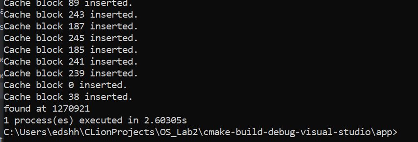

# Лабораторная работа #2 по ОС
## Отчёт

* Выполнил: Щербинин Эдуард Павлович, P3314
* Преподаватель: Рогачев Михаил Сергеевич
* Вариант: `Windows LFU`

## Задание

Для оптимизации работы с блочными устройствами в ОС существует кэш страниц с данными, которыми мы производим операции чтения и записи на диск. Такой кэш позволяет избежать высоких задержек при повторном доступе к данным, так как операция будет выполнена с данными в RAM, а не на диске (вспомним пирамиду памяти).

В данной лабораторной работе необходимо реализовать блочный кэш в пространстве пользователя в виде динамической библиотеки (dll или so). Политику вытеснения страниц и другие элементы задания необходимо получить у преподавателя.

При выполнении работы необходимо реализовать простой API для работы с файлами, предоставляющий пользователю следующие возможности:

1. Открытие файла по заданному пути файла, доступного для чтения. Процедура возвращает некоторый хэндл на файл. Пример:
`int lab2_open(const char *path)`.
2. Закрытие файла по хэндлу. Пример:
`int lab2_close(int fd)`.
3. Чтение данных из файла. Пример:
`ssize_t lab2_read(int fd, void buf[.count], size_t count)`.
4. Запись данных в файл. Пример:
`ssize_t lab2_write(int fd, const void buf[.count], size_t count)`.
5. Перестановка позиции указателя на данные файла. Достаточно поддержать только абсолютные координаты. Пример:
`off_t lab2_lseek(int fd, off_t offset, int whence)`.
6. Синхронизация данных из кэша с диском. Пример:
`int lab2_fsync(int fd)`.

Операции с диском разработанного блочного кеша должны производиться в обход page cache используемой ОС.

В рамках проверки работоспособности разработанного блочного кэша необходимо адаптировать указанную преподавателем программу-загрузчик из ЛР 1, добавив использование кэша. Запустите программу и убедитесь, что она корректно работает. Сравните производительность до и после.

### Ограничения
* Программа (комплекс программ) должна быть реализован на языке C или C++.
* Запрещено использовать высокоуровневые абстракции над системными вызовами. Необходимо использовать, в случае Unix, процедуры libc.

## Обзор кода

* Реализация непосредственно LFU-кэша (и его политики вытеснения) находится в файле [LFUCache.cpp](CacheReader/LFUCache.cpp)
* Реализация Reader-а, читающего информацию в обход ОС-кэша и используя собственную реализацию находится в файле [CacheReader.cpp](CacheReader/CacheReader.cpp)
* Описание функций API для работы с DLL-библиотекой находится в [CacheReaderAPI.h](CacheReader/CacheReaderAPI.h). Функции можно вызывать как из языка C, так и из C++
* Код нагрузчика из ЛР1 переписан так, чтобы он читал по одному случайному числу из файла, вместо больших блоков по 32Mb, и находится в [CacheTest_EmaSearchInt.cpp](app/CacheTest_EmaSearchInt.cpp) (для проверки кэша)
  * Seed для функций с кэшем и без одинаковый => количество обращений к файлу одинаково

## Сравнение нагрузчика с и без кэша

Сначала разкомментируем функцию `os::compute_no_cache();` для замера скорости работы программы без программного кэширования.
Для замера времени используем Shell из ЛР1:

Для этого программе потребовалось ~6 секунд.

Разкомментируем `os::compute();` для замера скорости, используя библиотеку `CacheReader.dll`:

Для этого программе потребовалось ~2.6 секунд, что более чем вдвое быстрее первого варианта.

Стоить отметить, что в первом варианте для чтения файла используются `_sopen_s()` и `_read()`,
которые не обходят кэш самой ОС, однако всё равно являются менее эффективными реализованного мной кэша.

## Вывод

По итогу выполнения лабораторной, я разобрался зачем нужен кэш при чтении файлов и как он работает.
Также я познакомился с различными политиками его вытестнения и реализовал `Least frequently used` кэш на языке C++.
Я разобрался как открыть, прочитать и записать в файл в обход кэша Windows: для этого пришлось использовать функции Win32 API с флагами.
В конце концов, я собрал динамичную библиотеку (DLL) с помощью компилятора MSVC, которую можно использовать при разработке других программ, не компилируя весь её код и использовать сразу несколькими процессами.
